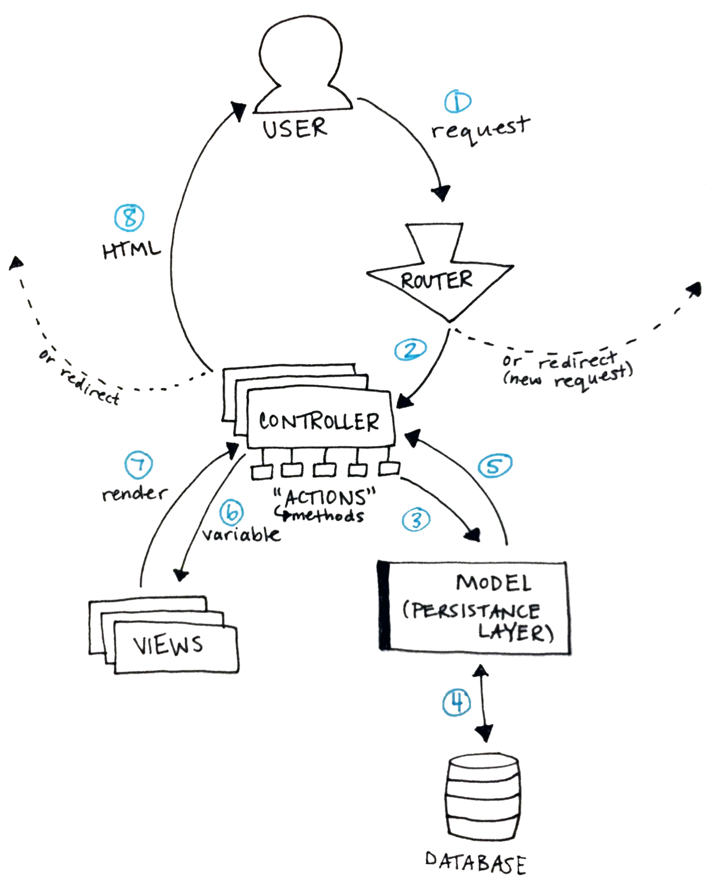

Ever wondered what your rails app is really doing? When I first started learning
rails it seemed like magic. I finally got started building some rails apps and
couldn’t believe I could get one up and running in 5 minutes. What is this
magic? Needless to say there’s a lot going on behind the scenes. I was living in
blissful ignorance, building away and not worrying about how it all worked until
it didn’t anymore. When the error messages stopped making sense, I realized I
should probably dig a little deeper and see what Rails’ magic is made of. You
don’t have to be able to rebuild Rails or even add to it, but understanding it
is at least a start and, IMO, important if you’re going to try to build with it,
if only because it makes debugging so much simpler. I’ve still got a long way to
go, but these are some notes from my first encounter with Rails’ machinery.

## MVC

Rails structures your web app using model, view, controller (MVC) architecture.
This just means it separates the different components of your app and the app
works by sending information between them. To understand this, it helped me to
think about what happens between a user clicking a button on a web page and
seeing the result. It seems like such a simple thing from the user’s point of
view, but — depending on what the button does — there could be a lot going on in
between. Keep this picture in mind as you read on:

Rails MVC architecture. Yes, I still take notes with paper.

<aside>
### HTTP

This is a quick aside because it’s hard to understand how your web app works
without understanding HTTP. If you don’t know anything about it there are
tons of free resources to give you a quick intro. This free book on the
basics of HTTP by Launch School is a great place to start. The gist of it is
that HTTP is the protocol your browser uses to send a request to a server
and receive a response. If that makes sense then you’re half way to
understanding the internet, and your Rails app. At a basic level all web
apps do is issue requests to servers and then handle the responses the
servers, well, serve.
</aside>

Back to the picture above, now. Maybe it looks like a lot at first, but breaking
down each step makes it easier to understand what’s going on.

## 1. Sending a Request

This isn’t really something Rails does, but it’s the first step in a user’s
interaction with your web app. This could be the user clicking a link or button,
submitting a form, refreshing the page, or a few other things. When your app
gets this request Rails magic kicks in to handle it.

## 2. Routing the Request

The first stop for any request is the Rails router. This is where Rails
deciphers the url and decides what to do with the request it just got. It can
redirect your user to another page (issuing a new request and starting the loop
over), or forward the request to a controller. What it does depends on how your
routes are configured. You can configure your routes in config/routes.rb, or see
which routes you have already defined by typing rake routes in your terminal.

## 3. Calling a Controller Action

If the request was sent on to a controller, the next step is for that controller
to call the appropriate “action”. These are just methods in the controller file,
called actions in Rails — I was so confused until I realized that controller
actions are just methods, and you write these methods to determine the behaviour
of your app. The controller in the MVC architecture connects the user to the
rest of the app. Controllers can accept user input and pass it on to the model,
which is the next step.

## 4. Interacting with the Database

The controller passes information to the model in your rails app, which is the
underlying engine that can store or manipulate the database powering your app.
It’s hard to understand why we need models without understanding the stateless
nature of the HTTP protocol:

<aside>
### Understanding Statelessness

Another key thing to understand about HTTP is that it is a “stateless”
protocol, so requests sent and responses received via HTTP have no state.
This means that each request/response cycle is completely independent of any
other cycle, implying that servers do not remember any information about the
state of our web apps between requests. You could think of a “state” as
being sort of like a user’s custom version of a web app. For example, if you
add something to an online shopping cart (one request), then continue
shopping (a new request), you expect the item to still be in your shopping
cart. Or if you log in to a website (one request) then visit a friend’s
profile page (a new request), you expect to stay logged in. How does the
server know to give you a version of the web app showing the item in your
cart or with you as the logged in user if it has no memory of your previous
requests? Simulating this “stateful”, or continuous experience is part of
what web developers do.
</aside>

Models are the persistence layer in your app and contain the logic for
interacting with the database. Storing this information is one trick developers
use to create the illusion of an app that remembers its users.

## 5. and 6. Sending Information to the Views

After the model finishes what the controller asked it to, it stores that
information in a variable to be passed back to the controller and on to to the
views. The idea is that there should be no logic at all in the views, they
should only act as a skin for your app, so the user has something nice to see
and interact with.

## 7. and 8. Rendering a View for the User

Views are like skins for your web pages and contain code that tells Rails how to
render a given web page, so what to show to the user. They can include
information accepted from the controller, which is how web pages can be rendered
“dynamically”, meaning they can be different depending on when they’re rendered
and who requested them. At this point, the controller action might render
particular view or might redirect the user to another web page, issuing a new
request and starting the loop over again. Happy Coding!

This is how I think about MVC, and Rails apps in particular. Of course there’s a
lot more depth and lots of “actually, sometimes…” cases, but this is a brief
overview to hopefully give you enough of an understanding to be able to get
started making your own Rails apps or at least make debugging tutorial apps a
little simpler. If there’s anything you think I’ve missed or misunderstood, let
me know! Otherwise, happy coding.
